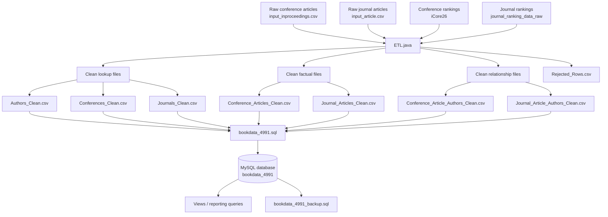
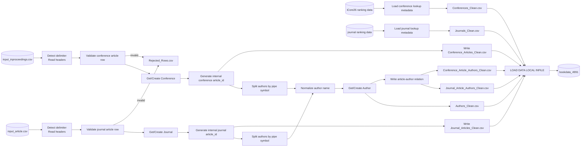
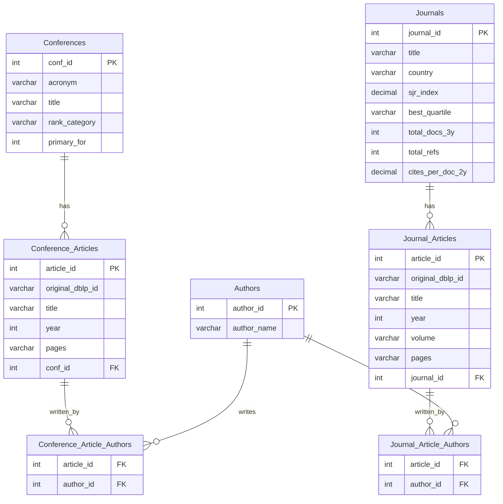

# Bibliometric Analytics System — ETL & Design Trade-offs

## 1. Σκοπός της Φάσης Ι

Η Φάση Ι υλοποιεί την ενοποίηση των βιβλιογραφικών δεδομένων σε μία ενιαία, καθαρή και επερωτήσιμη βάση δεδομένων MySQL.

Ο βασικός στόχος είναι τα raw αρχεία να μετασχηματιστούν σε:

- lookup/reference tables με σταθερά IDs,
- factual tables για άρθρα συνεδρίων και περιοδικών,
- N:M relationship tables για τη σχέση άρθρων–συγγραφέων,
- primary keys και foreign keys,
- επαναλήψιμα ETL και loading scripts,
- backup της φορτωμένης βάσης.

---

## 2. Input δεδομένα

| Αρχείο / Φάκελος | Περιγραφή |
|---|---|
| `input_inproceedings.csv` | Raw DBLP records για άρθρα συνεδρίων |
| `input_article.csv` | Raw DBLP records για άρθρα περιοδικών |
| `iCore26_KilledColumnsForLoading.csv` | Ranking / metadata για συνέδρια |
| `journal_ranking_data_raw/journal_ranking_data_raw.csv` | Ranking / metadata για περιοδικά |
| `bestSubjectArea.csv` | Συμπληρωματική κατηγοριοποίηση περιοδικών, όπου χρησιμοποιείται |

Στα DBLP αρχεία, οι συγγραφείς βρίσκονται σε ένα πεδίο χωρισμένοι με `|`, άρα απαιτείται μετασχηματισμός σε κανονικοποιημένη N:M σχέση.

---

## 3. ETL Pipeline



---

## 4. Logical ETL Activity Diagram



---

## 5. Database Schema Overview



---

## 6. Transformation Rules

### 6.1 Συγγραφείς

Οι συγγραφείς στο raw DBLP input βρίσκονται σε ένα πεδίο:

```text
Author A|Author B|Author C
```

Το ETL:

1. χωρίζει το πεδίο με βάση το `|`,
2. καθαρίζει κενά και ειδικούς χαρακτήρες,
3. κανονικοποιεί το όνομα για σύγκριση,
4. δημιουργεί μοναδικό `author_id`,
5. γράφει τις σχέσεις άρθρου–συγγραφέα στα junction files.

Η κανονικοποίηση περιλαμβάνει lowercase, αφαίρεση accents, αντικατάσταση ειδικών χαρακτήρων και collapse πολλαπλών κενών.

---

### 6.2 Άρθρα συνεδρίων και περιοδικών

Τα άρθρα συνεδρίων και περιοδικών είναι παρόμοια αλλά όχι ίδια. Για αυτό κρατήθηκαν σε ξεχωριστά factual tables:

- `Conference_Articles`
- `Journal_Articles`

Κάθε άρθρο έχει εσωτερικό numeric `article_id`, `original_dblp_id` για traceability, τίτλο, χρονιά, metadata και foreign key προς `Conferences` ή `Journals`.

---

### 6.3 Rejected rows

Προβληματικές εγγραφές δεν φορτώνονται σιωπηλά στη βάση. Γράφονται στο:

```text
Rejected_Rows.csv
```

Παραδείγματα λόγων απόρριψης:

- missing original DBLP id,
- missing title,
- invalid year,
- missing conference/booktitle,
- missing journal title.

---

## 7. Loading Process

Το SQL script που δημιουργεί και φορτώνει τη βάση είναι:

```text
bookdata_4991.sql
```

Η σειρά φόρτωσης είναι σημαντική λόγω foreign keys:

1. `Authors`
2. `Conferences`
3. `Journals`
4. `Conference_Articles`
5. `Journal_Articles`
6. `Conference_Article_Authors`
7. `Journal_Article_Authors`

Το script χρησιμοποιεί:

```sql
LOAD DATA LOCAL INFILE './file.csv'
```

ώστε να φορτώνει αρχεία απευθείας από το project folder.

---

## 8. How to reproduce

### 8.1 Run ETL

Από το project folder:

```powershell
java ETL
```

Το ETL παράγει:

```text
Authors_Clean.csv
Conferences_Clean.csv
Journals_Clean.csv
Conference_Articles_Clean.csv
Journal_Articles_Clean.csv
Conference_Article_Authors_Clean.csv
Journal_Article_Authors_Clean.csv
Rejected_Rows.csv
```

### 8.2 Load database

```powershell
cmd /c """C:\Program Files\MySQL\MySQL Server 8.0\bin\mysql.exe"" --local-infile=1 -u root -p < bookdata_4991.sql"
```

### 8.3 Backup database

```powershell
cmd /c """C:\Program Files\MySQL\MySQL Server 8.0\bin\mysqldump.exe"" -u root -p --databases bookdata_4991 > bookdata_4991_backup.sql"
```

---

## 9. Loaded Data Summary

Μετά την τελευταία επιτυχημένη φόρτωση:

| Table | Rows loaded |
|---|---:|
| `Authors` | 1,394,699 |
| `Conferences` | 6,601 |
| `Journals` | 10,305 |
| `Conference_Articles` | 1,413,090 |
| `Journal_Articles` | 1,112,661 |
| `Conference_Article_Authors` | 4,122,002 |
| `Journal_Article_Authors` | 2,928,502 |

Foreign-key consistency checks:

| Check | Result |
|---|---:|
| `orphan_conference_article_author_rows` | 0 |
| `orphan_journal_article_author_rows` | 0 |

---

## 10. Design Trade-offs

### 10.1 Separate article tables vs one unified table

**Decision:** Χρησιμοποιούνται δύο factual tables: `Conference_Articles` και `Journal_Articles`.

**Why:** Τα conference και journal articles έχουν παρόμοια αλλά όχι ίδια δομή.

**Trade-off:** Το schema είναι καθαρότερο και έχει λιγότερα nullable πεδία, αλλά queries που αφορούν όλες τις δημοσιεύσεις χρειάζονται `UNION` ή unified view.

---

### 10.2 Internal numeric IDs vs source IDs

**Decision:** Χρησιμοποιούνται εσωτερικά numeric IDs (`article_id`, `author_id`, `conf_id`, `journal_id`).

**Why:** Τα numeric keys είναι πιο αποδοτικά για joins, indexes και foreign keys.

**Trade-off:** Καλύτερη απόδοση και σταθερό relational schema, αλλά το ETL πρέπει να διατηρεί mapping από source IDs σε internal IDs. Το αρχικό DBLP id κρατιέται ως `original_dblp_id`.

---

### 10.3 Normalize authors vs preserve raw author strings

**Decision:** Οι συγγραφείς κανονικοποιούνται και αποθηκεύονται σε ξεχωριστό lookup table.

**Why:** Το raw format με `Author A|Author B|Author C` δεν επιτρέπει σωστά author profiles, distinct counts ή N:M joins.

**Trade-off:** Υποστηρίζονται σωστά author queries, αλλά υπάρχει πιθανότητα δύο διαφορετικά ονόματα να συγχωνευτούν αν η normalized μορφή τους συμπίπτει. Η εργασία θεωρεί ότι δεν χειριζόμαστε συνωνυμίες/ομωνυμίες συγγραφέων.

---

### 10.4 CSV intermediate files vs direct DB inserts

**Decision:** Το `ETL.java` παράγει intermediate clean CSV files και μετά το MySQL script τα φορτώνει με `LOAD DATA`.

**Why:** Είναι απλό, διαφανές και επαναλήψιμο για το scope της εργασίας.

**Trade-off:** Τα intermediate files μπορούν να ελεγχθούν εύκολα και φορτώνονται γρήγορα, αλλά απαιτούν επιπλέον χώρο και δύο βήματα εκτέλεσης.

---

### 10.5 Reject invalid rows vs force loading

**Decision:** Οι invalid rows γράφονται σε `Rejected_Rows.csv`.

**Why:** Είναι καλύτερο να απομονώνονται τα προβληματικά records παρά να χαλάνε την ποιότητα της βάσης.

**Trade-off:** Προστατεύεται η consistency της βάσης, αλλά κάποια source records δεν φορτώνονται μέχρι να διορθωθούν.

---

### 10.6 More work in DBMS vs more work in Java

**Decision:** Το ETL κάνει cleaning/loading preparation, αλλά τα reporting queries σχεδιάζονται ώστε να γίνονται με SQL views/direct queries.

**Why:** Η εφαρμογή πρέπει να αξιοποιεί το DBMS για aggregation και filtering, όχι να φέρνει όλα τα δεδομένα στη μνήμη.

**Trade-off:** Καλύτερη κλιμάκωση και πιο καθαρό backend, αλλά απαιτείται προσοχή σε SQL views, indexes και query optimization.

---

### 10.7 Simple Java ETL vs dedicated ETL tool

**Decision:** Το ETL υλοποιήθηκε με Java script αντί για Pentaho/Kettle, KNIME ή άλλο ETL εργαλείο.

**Why:** Για το πλαίσιο της εργασίας, ένα script είναι πιο άμεσο, εύκολο να τρέξει και εύκολο να μπει στο GitHub.

**Trade-off:** Λιγότερες εξαρτήσεις και απλή αναπαραγωγή, αλλά λιγότερο οπτικό workflow και λιγότερα built-in ETL features. Το README καλύπτει το workflow με Mermaid diagrams.

---

## 11. Suggested project structure

```text
bibliometric_analytics_system/
├── ETL.java
├── bookdata_4991.sql
├── bookdata_4991_backup.sql
├── input_inproceedings.csv
├── input_article.csv
├── Authors_Clean.csv
├── Conferences_Clean.csv
├── Journals_Clean.csv
├── Conference_Articles_Clean.csv
├── Journal_Articles_Clean.csv
├── Conference_Article_Authors_Clean.csv
├── Journal_Article_Authors_Clean.csv
├── Rejected_Rows.csv
├── README.md
└── diagrams/
    ├── etl_pipeline_diagram.mmd
    ├── etl_activity_diagram.mmd
    └── schema_er_diagram.mmd
```
